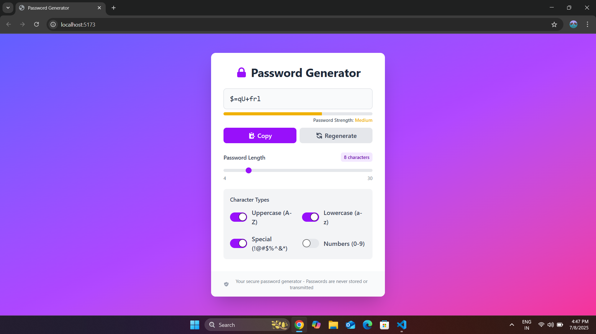

# Password Generator

A modern, responsive password generator built with **React** and **Vite**, featuring strength indication, character options, clipboard copying, and automatic regeneration based on user preferences.

---

## Features

-  Generate secure random passwords
-  Customizable password length (4–30 characters)
-  Toggle options for:
  -- Uppercase letters (A–Z)
  -- Lowercase letters (a–z)
  -- Numbers (0–9)
  -- Symbols (!@#$%^&*)
-  Visual password strength indicator (Weak / Medium / Strong)
-  Copy password to clipboard with one click
-  Responsive and mobile-friendly UI

---

## Tech Stack

- **Frontend**: React (with Hooks)
- **Build Tool**: [Vite](https://vitejs.dev/)
- **Styling**: Tailwind CSS
- **Icons**: Heroicons

---

## Installation

### 1. **Clone the repository**

```bash
git clone https://github.com/your-username/password-generator.git
cd password-generator
```

### 2. **Install dependencies**

```bash
npm install
```

### 3. Start the development server

```bash
npm run dev
```
---

## Project Structure

```pgsql

├── public/
├── src/
│   ├── App.jsx
│   ├── App.css
│   └── main.jsx
├── index.html
├── package.json
├── vite.config.js
├── .gitignore
└── README.md
```

---

## License

This project is licensed under the MIT License.

---

## Acknowledgments

React

Vite

Tailwind CSS

Heroicons

---

## Preview


